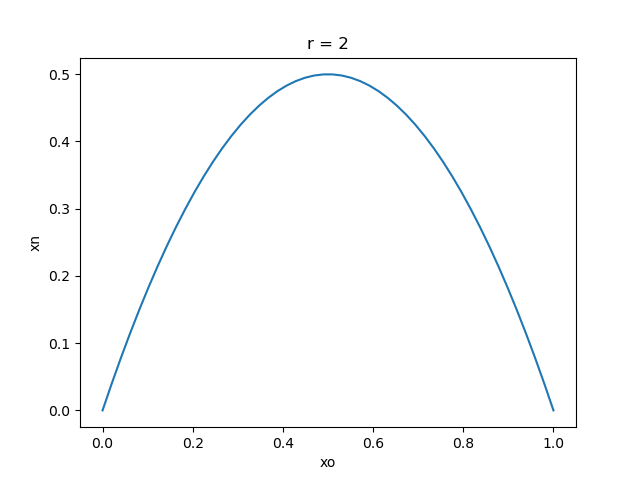
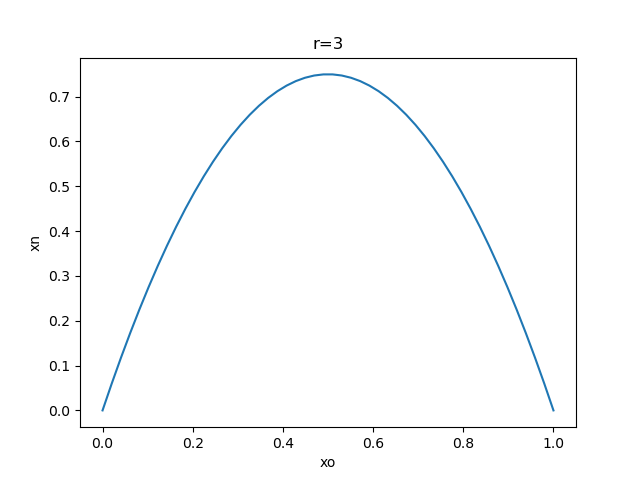
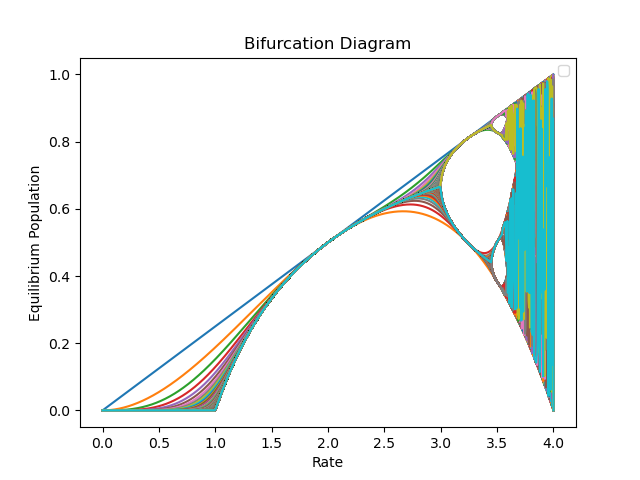
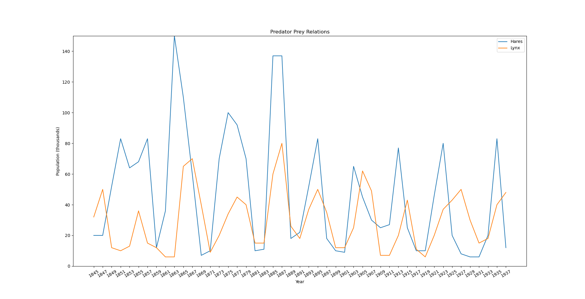

## Modelling Animal Population Growth Using the Logistic Map Equation
A case study centered around the logistic map equation and its applications to complex systems and the chaos theory
especially as a model for population growth over time.

### Contributors:
- Palak Sood
- Kathlene Titus
- Taylor Von Hausen

### Project Description:

Rabbit population can be studied using the logistic map equation which models population growth or decline over several generations.

The logistic map equation was used to observe the different growth rates and the effect different rates have on future iterations.

The logistic map's bifurcation diagram was recreated in order to further investigate the periods of stability within the logistic map equation. It was noted that when the growth rate value, r, reaches 3, the population oscillates between multiple values and does not stabilize at a certain value.

Furthermore, the Lokta-Volterra equation were used to describe the dynamics of biological systems in which two species interact. To verify this model, population of snowshoe hares and lynx was used to see the relationship between the predator and prey. Data
was obtained from the Hudson Bay Compan's archives in which they estimated Snow Shoe Hare and Lynx populations based on the 
number of pelts sold each year.

Results from the experiment prove the similarities between the logistic map and Lokta-Volterra equations, particularly their cyclic nature.

### Acknowledgements:
We would like to extend our sincere thanks to Dr. Thorsteinn Jonsson for his expertise, valuable advice, and constructive suggestions throughout the course of this project.
We also want to express our appreciation to Matthew Saunders and Shahrzad Hadayeghparast for their continuous support, guidance and feedback. 

A special thanks to Jonny Hyman and Cyrille Rossant as the code was based off of their work. We would also like to thank Veritasium for the amazing video about the logistic map that inspired us to choose this project.

### References:

[1] Avery Thompson, 2017. How the Science of Population Growth is related 

to Famous Fractal. Retrieved from 

https://www.popularmechanics.com/science/math/a24804/population-growth/mandelbrot-set/ 

 
[2] Allen B.Downey Think Complexity: Exploring Complexity Science in Python. Green Tea Press, Needham, Massachusetts, 2016. 

  
[3] Boeing, G. author B. (2016, October 21). Chaos Theory and the Logistic Map. Retrieved from https://geoffboeing.com/2015/03/chaos-theory-logistic-map/ 

 
[4] Blaszak, T. (n.d.). Retrieved from http://web.mst.edu/~huwen/teaching_Predator_Prey_Tyler_Blaszak.pdf 

 
[5] Bradley, L. (n.d.). Chaos & Fractals - Logistic Equation. Retrieved from https://www.stsci.edu/~lbradley/seminar/logdiffeqn.html 

 
[6] Brockmann, D. (2018, April 30). The Logistic Map - The mother of deterministic chaos. Retrieved from https://www.complexity-explorables.org/flongs/logistic/ 

 
[7] Chaos! (n.d.). Fractal Foundation. Retrieved from 

https://fractalfoundation.org/OFC/OFC-6-1.html 

 
[8] Cyrille Rossant, IPython Books (2020), GitHub repository, 

https://github.com/ipython-books 

 
[9] Eicksen, J., Stolleis, K. (n.d.). Introduction to Chaos and the Logistic Map Retrvied from https://fricke.co.uk/Teaching/CS523_2013spring/Project1/ExampleSolution2.pdf 

 
[10] Jonny Hyman, Chaos (2020), GitHub repository, 

https://github.com/jonnyhyman/Chaos 

 
[11] Symbiotic Interaction of Two Species. [online] Arxiv.org. Retrived from https://arxiv.org/pdf/nlin/0401045.pdf [Accessed 28 April 2020]. 

 
[12] Takeuchi, Y., Du, N. H., Hieu, N. T., & Sato, K. (2005, December 7). Evolution of predator–prey systems described by a Lotka–Volterra equation under random environment. Retrieved from https://www.sciencedirect.com/science/article/pii/S0022247X0501142X 

 
[13] What is Chaos Theory? (n.d.). Retrieved from https://fractalfoundation.org/resources/what-is-chaos-theory/ 

 
[14] Veritasium. 2020. This equation will change how you see the world (logistic          map). Video. (29 Jan 2020). Retrived from  https://www.youtube.com/watch?v=ovJcsL7vyrk 

 
[15] Volterra Model. (n.d.). Retrieved from https://www.sciencedirect.com/topics/engineering/volterra-model 

 
[16] Bacaër, N. (1970, January 1). Verhulst and the logistic equation (1838). Retrieved from https://link.springer.com/chapter/10.1007/978-0-85729-115-8_6 

 
[17] Stephen, A. (2017, June 30). Modelling Rabbit Populations; an Introduction to Chaos Theory. Retrieved from http://www.alaricstephen.com/main-featured/2017/6/29/modelling-rabbit-populations-an-introduction-to-chaos-theory 

